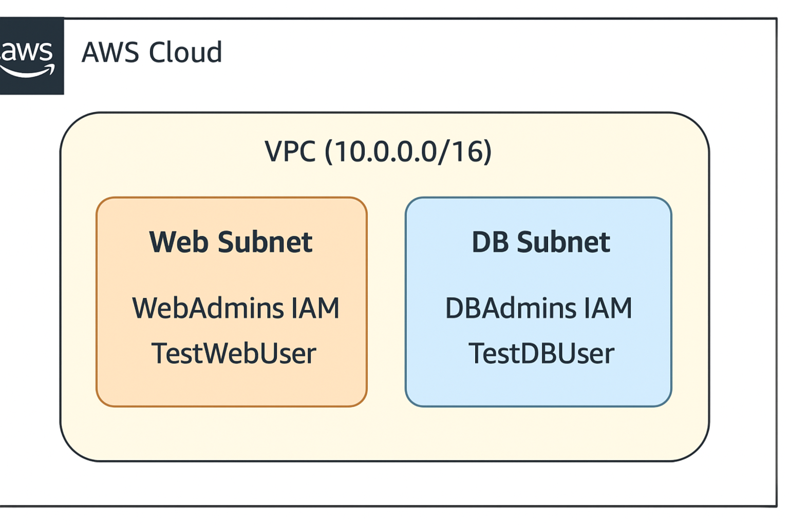
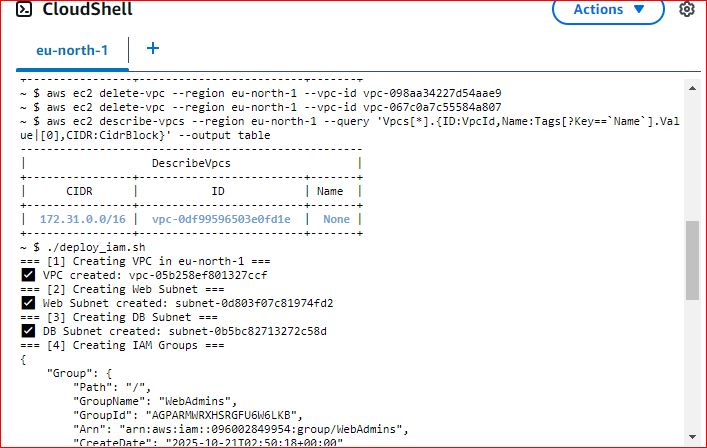
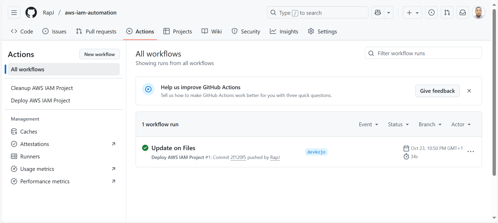
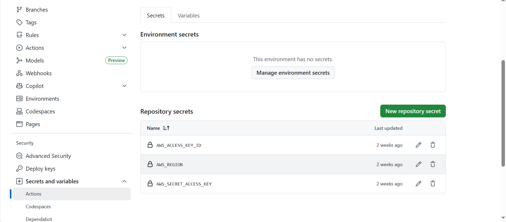

# 🛡️ Project 4: IAM Roles and Secure Access Automation (AWS Implementation)

## 📘 Overview
This project automates secure **Identity and Access Management (IAM)** and **network infrastructure setup** in AWS using **Bash scripting** and **GitHub Actions (CI/CD)**.  
It ensures consistency, security, and repeatability in cloud deployments — key for DevOps and cloud automation.

---

## 🎯 Objectives
- Automate IAM setup (users, groups, roles, policies)  
- Automate VPC and subnet creation  
- Assign least-privilege permissions to IAM groups  
- Integrate automation with GitHub CI/CD  
- Enable cleanup automation for cost and resource control  

---

## 🧩 Architecture Diagram

Below is a conceptual design of the automated AWS setup:

```
+---------------------------------------------------+
|                     AWS Cloud                     |
|                                                   |
|  +---------------------+       +----------------+ |
|  |  Web Subnet (AZ A)  |       | DB Subnet (AZ B)| |
|  |  - WebAdmins IAM     |       | - DBAdmins IAM  | |
|  |  - TestWebUser       |       | - TestDBUser    | |
|  +---------------------+       +----------------+ |
|                                                   |
|             VPC (10.0.0.0/16)                     |
+---------------------------------------------------+
```

📸 *Image Placeholder:*  



---

## ⚙️ Automation Flow

### **1️⃣ Deployment Script (`deploy_iam.sh`)**
Automates:
- Creation of VPC and subnets  
- IAM groups (`WebAdmins`, `DBAdmins`)  
- IAM users (`TestWebUser`, `TestDBUser`)  
- Group assignments and role permissions  

Run manually:
```bash
bash deploy_iam.sh
```

📸 *Placeholder:*  


---

### **2️⃣ Cleanup Script (`cleanup_iam.sh`)**
Safely deletes all created AWS resources.

Run manually:
```bash
bash cleanup_iam.sh
```

📸 *Placeholder:*  


---

## 🔁 CI/CD Pipeline (GitHub Actions)

| Workflow | Trigger | Description |
|-----------|----------|-------------|
| `deploy.yml` | On push to `main` | Deploys VPC, IAM groups, and users |
| `cleanup.yml` | Manual trigger | Cleans up all AWS resources |

┌──────────────┐      ┌─────────────────────┐      ┌───────────────────────┐
│  Developer   │ ---> │  Push to GitHub     │ ---> │  GitHub Actions Deploy │
└──────────────┘      └─────────────────────┘      └───────────────────────┘
                                                          │
                                                          ▼
                                                  AWS CLI Executes Scripts
                                                          │
                                                          ▼
                                                   IAM + VPC Created


📸 *Placeholder:*  


### **CI/CD Flow Diagram**
```
Developer → Push to GitHub → GitHub Actions Deploy → AWS CLI Executes → IAM + VPC Created
```

---

## 🔐 Security Considerations
- AWS credentials stored as **GitHub Secrets**
  - `AWS_REGION`
  - `AWS_ACCESS_KEY_ID`
  - `AWS_SECRET_ACCESS_KEY`
- IAM uses **least privilege** model  
- All AWS resources tagged for auditing  

📸 *Placeholder:*  


---

## 🧱 Folder Structure
```
aws-iam-cicd-project/
│
├── deploy_iam.sh
├── cleanup_iam.sh
├── README.md
└── .github/
    └── workflows/
        ├── deploy.yml
        └── cleanup.yml
```

---

## 🚀 How to Use

1. **Clone the repository**
   ```bash
   git clone (https://github.com/RapJ/aws-iam-automation.git)
   cd aws-iam-automation
   ```

2. **Add AWS credentials in GitHub Secrets**
   - Go to your repository → **Settings → Secrets → Actions**

3. **Push to main branch**
   - Automatically triggers deployment

4. **Monitor GitHub Actions**
   - Watch real-time execution in **Actions tab**

5. **Run cleanup manually**
   - Go to **Actions → Cleanup Workflow → Run Workflow**

---

## 🧠 Learning Outcomes
You will learn to:
- Use **AWS CLI** for infrastructure automation  
- Implement **IAM roles and access control**  
- Create **GitHub Actions workflows** for CI/CD  
- Manage infrastructure with **Bash scripting**  
- Apply **Infrastructure-as-Code (IaC)** concepts  

---

## 📸 Screenshot Requirements
Add screenshots for submission:
1. Successful **GitHub Actions** pipeline run  
2. IAM Groups & Users in AWS Console  
3. VPC & Subnets visible in AWS Console  
4. GitHub Secrets Configuration page  

---

## 🧰 Tools & Technologies
- AWS CLI  
- GitHub Actions  
- Bash scripting  
- IAM & VPC  
- CI/CD Automation  

---

## ✅ Deliverables
- `deploy_iam.sh` and `cleanup_iam.sh` scripts  
- `.github/workflows/deploy.yml` and `.github/workflows/cleanup.yml`  
- `README.md` with visuals  
- Screenshot folder `/images`  

---

⚠️ Challenges Faced During Execution

Implementing this AWS IAM automation project came with several technical and procedural challenges. Below are the key difficulties encountered and how they were addressed:

1️⃣ AWS Resource Limits

Challenge:
While creating VPCs using AWS CLI, the error VpcLimitExceeded occurred because the default AWS account allows only 5 VPCs per region.

Resolution:
Manually deleted unused VPCs using:

aws ec2 delete-vpc --vpc-id <vpc-id>


or requested a limit increase from AWS Support.

2️⃣ Existing IAM Entities

Challenge:
Repeated executions of the automation scripts resulted in errors such as:

EntityAlreadyExists: Group with name WebAdmins already exists.


and

EntityAlreadyExists: User with name TestWebUser already exists.


Resolution:
Enhanced the script with logic to check if a user or group already exists before creating it, preventing duplication and errors.

3️⃣ AWS CLI Parameter Errors

Challenge:
Errors like

MissingParameter: The request must contain the parameter resourceIdSet


occurred when tagging VPCs or subnets before their IDs were captured.

Resolution:
Used command substitution properly:

VPC_ID=$(aws ec2 create-vpc --cidr-block 10.0.0.0/16 --query 'Vpc.VpcId' --output text)


and added delays (sleep 3) after creation to ensure resource availability before tagging.

4️⃣ Region Configuration

Challenge:
Scripts failed when the AWS CLI default region wasn’t set, causing errors like:

You must specify a region. You can also configure your region by running "aws configure".


Resolution:
Explicitly added the region flag to every AWS CLI command:

--region eu-north-1

5️⃣ GitHub Actions Permission Setup

Challenge:
The GitHub CI/CD workflows initially failed because AWS credentials were not configured in GitHub Secrets.

Resolution:
Added the required credentials in the repository under:
Settings → Secrets and Variables → Actions → New Repository Secret

AWS_ACCESS_KEY_ID

AWS_SECRET_ACCESS_KEY

6️⃣ IAM Policy Permissions

Challenge:
Certain IAM operations were denied due to insufficient permissions tied to the AWS user executing the CLI commands.

Resolution:
Granted temporary AdministratorAccess or ensured the user had specific IAM privileges such as:

iam:CreateUser

iam:CreateGroup

iam:AttachGroupPolicy

ec2:CreateVpc

ec2:CreateSubnet

7️⃣ CI/CD Workflow Debugging

Challenge:
GitHub Actions failed silently when YAML formatting was incorrect.

Resolution:
Validated the workflows using:

act -j deploy


and online YAML linting tools to verify syntax correctness.

8️⃣ Cleanup Automation

Challenge:
Automating cleanup required careful sequencing — IAM users must be removed from groups before groups can be deleted.

Resolution:
Modified the cleanup_iam.sh script to:

Detach policies

Remove users from groups

Delete groups and users in the correct order

9️⃣ Time Delays in Resource Propagation

Challenge:
AWS resources (like IAM entities) take a few seconds to propagate globally. Immediate verification commands sometimes failed.

Resolution:
Added short pauses (sleep 5) between critical operations to allow AWS propagation.

🔟 Documentation and Visual Design

Challenge:
Creating a professional and explanatory visual (architecture diagram, workflow chart, screenshots) took extra time for clarity and presentation.

## 🏁 Summary
This project showcases **end-to-end DevOps automation** using AWS and GitHub.  
It provides a secure, repeatable model for managing cloud IAM and infrastructure via CI/CD pipelines.

---
